# 🧭 Northwind Dashboard

**Next.js 16**, **Supabase** ve **Chakra UI** ile geliştirilmiş modern, full-stack bir iş zekası panelidir. Klasik Northwind veritabanından ilham alınarak oluşturulan bu uygulama; siparişler, ürünler, müşteriler ve bölgesel satış analizleri hakkında gerçek zamanlı içgörüler sunar. Şık, duyarlı bir arayüz ve karanlık mod desteğiyle birlikte gelir.

---

## 📸 Önizleme

### Dashboard
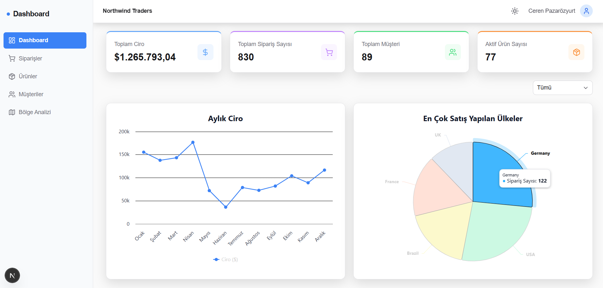

### Siparişler
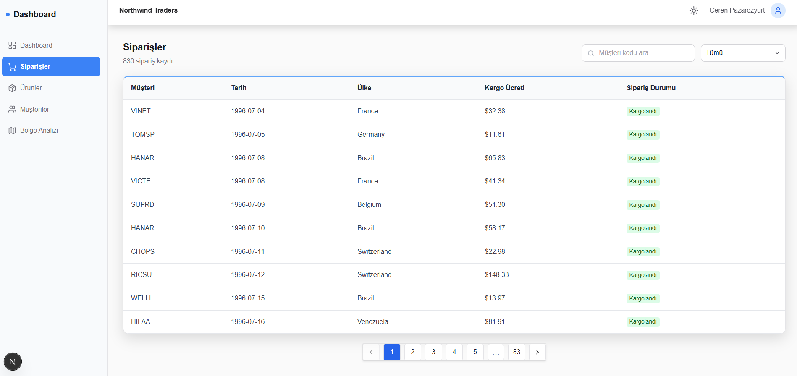

### Sipariş Detayı
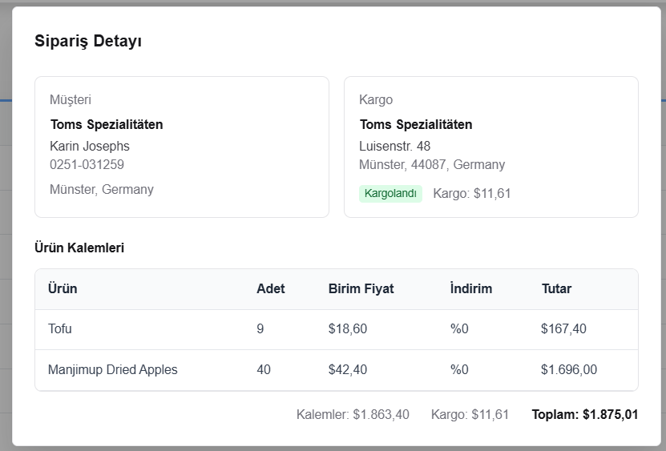

### Ürünler
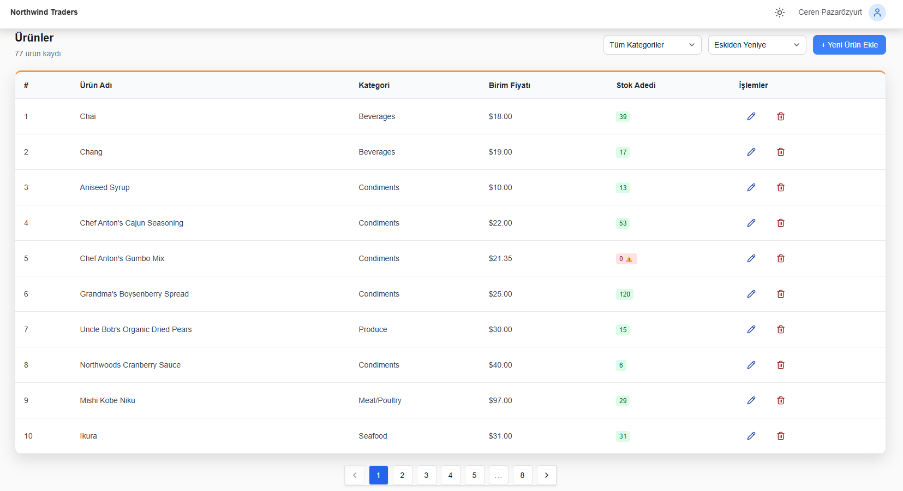

### Müşteriler
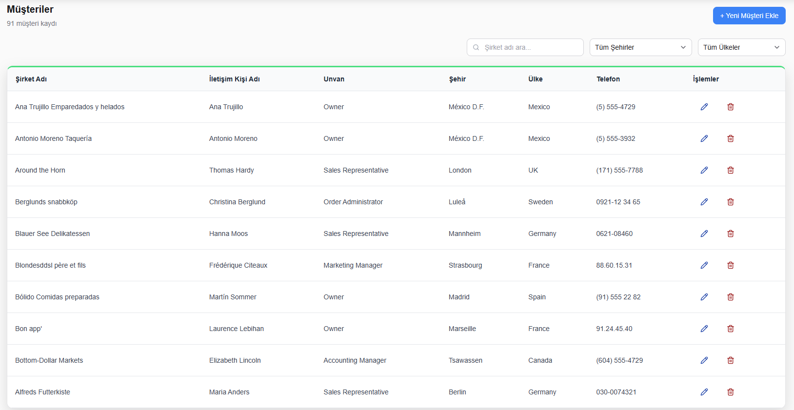

### Bölge Analizi — Açık Tema
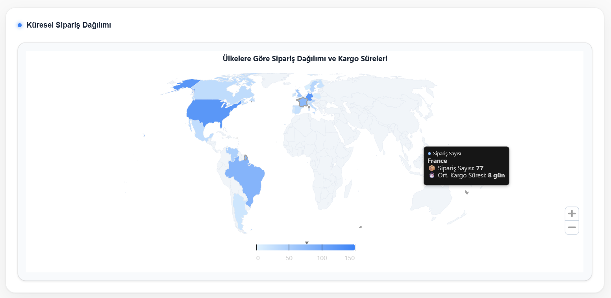

### Bölge Analizi — Koyu Tema
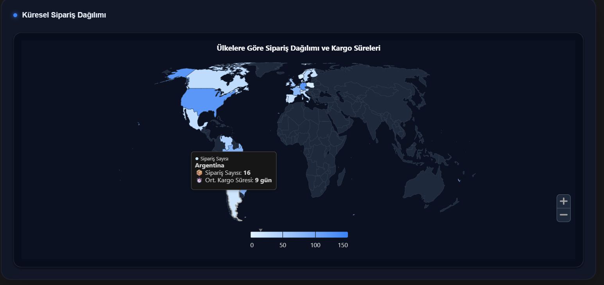

### Kimlik Doğrulama
| Giriş Yap | Kayıt Ol |
|-----------|----------|
| 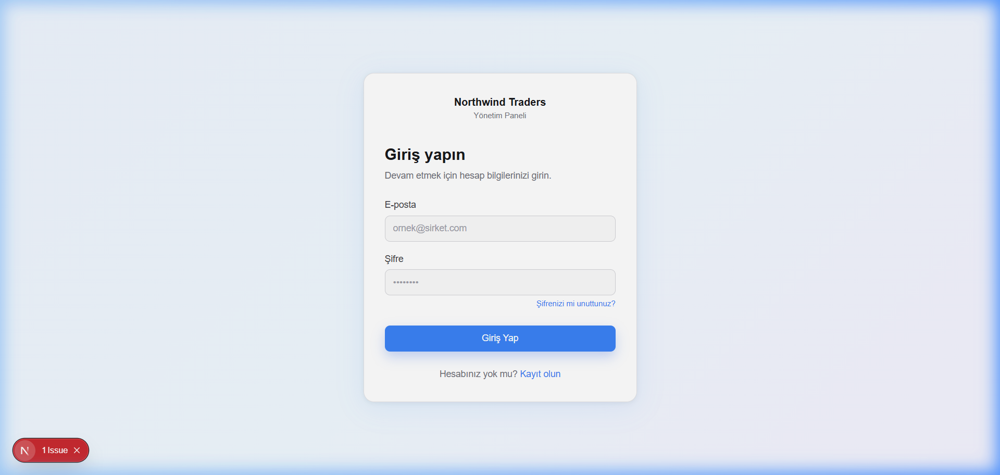 | 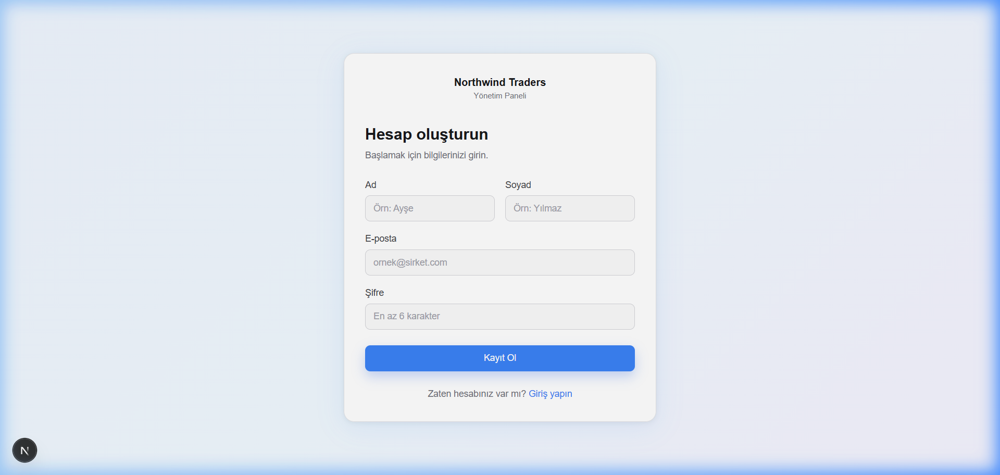 |

### E-posta Doğrulama Akışı
| Gelen Kutusu Bildirimi | Doğrulama E-postası | Hesap Onaylandı |
|------------------------|---------------------|-----------------|
| 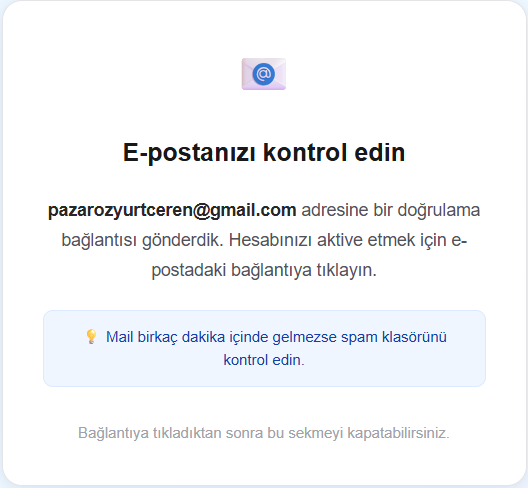 | 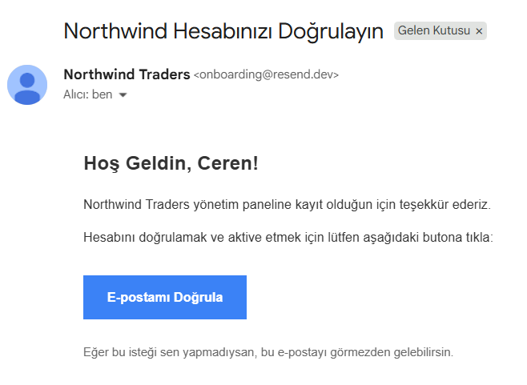 | 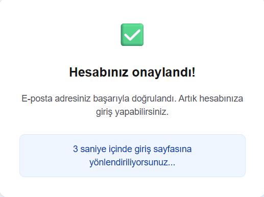 |

### Şifre Sıfırlama
| Şifremi Unuttum | Yeni Şifre Belirle |
|-----------------|-------------------|
| 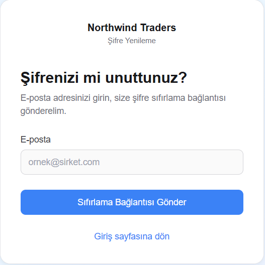 | 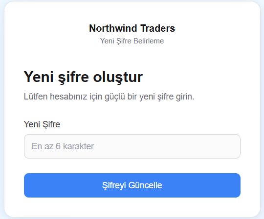 |

---

## ✨ Özellikler

### 📊 Dashboard
- KPI özet kartları: **Toplam Ciro**, **Sipariş Sayısı**, **Müşteri Sayısı**, **Aktif Ürün Sayısı**
- Yıl filtresiyle **Aylık Ciro** bar grafiği (1996 / 1997 / 1998 / Tümü)
- **En Çok Satış Yapılan Ülkeler** interaktif pasta grafiği
- Tüm grafiklerin renk temasına tam uyum (araç ipucu, eksen etiketleri, arka plan)

### 📦 Siparişler
- **TanStack Table** ile sayfalandırılmış, aranabilir sipariş tablosu
- **Ülke** ve **müşteri kodu** bazlı filtreleme (`nuqs` ile URL'de korunan durum)
- Herhangi bir satıra tıklayarak kalemleri, indirimleri ve toplamı gösteren **sipariş detay modali**
- Düzgün geçişlerle sıralanabilir sütunlar

### 🛍️ Ürünler
- Tam **CRUD** işlemleri: Oluştur, Listele, Güncelle, Sil
- **Kategori** bazlı filtreleme ve ada göre sıralama (artan / azalan)
- Silme işlemi öncesi onay diyalogu
- **React Hook Form** + **Zod** ile form doğrulama
- Her veri değişiminde toast bildirimleri

### 👥 Müşteriler
- Müşteri kayıtları için tam **CRUD** işlemleri
- **Şirket adı** araması, **şehir** ve **ülke** filtresi
- Paylaşılabilir ve geri tuşuyla uyumlu URL tabanlı sayfalandırma

### 🗺️ Bölge Analizi
- **İnteraktif dünya haritası** (Highcharts Maps + Highmaps topolojisi)
- Ülke bazlı sipariş yoğunluğu renk kodlaması
- Her ülke için sipariş sayısı ve ortalama kargo süresi gösterimli araç ipuçları
- Yakınlaştırma, kaydırma ve etkileşimli harita desteği
- Glassmorphism kart sarmalayıcı ile tam tema uyumu

### 🔐 Kimlik Doğrulama
- **Supabase Auth** (e-posta + şifre)
- Kayıt Ol, Giriş Yap, Şifre Unut, E-posta Doğrulama, Şifre Güncelleme akışları
- **Resend** aracılığıyla gönderilen markalı işlem e-postaları
- Next.js Middleware ile **rota koruması** — doğrulanmamış kullanıcılar `/login` adresine yönlendirilir
- Giriş yapmış kullanıcılar `/login` ve `/register` sayfalarına erişemez

### 🌗 Koyu / Açık Tema
- İlk yüklemede sistem tercihi algılama
- `next-themes` aracılığıyla oturumlar arasında kalıcı manuel geçiş
- Tüm Chakra UI bileşenleri ve özel grafikler aktif temayı yansıtır

---

## 🛠️ Teknoloji Yığını

| Katman | Teknoloji |
|--------|-----------|
| **Framework** | [Next.js 16](https://nextjs.org) (App Router) |
| **Dil** | TypeScript 5 |
| **UI Kütüphanesi** | [Chakra UI v3](https://chakra-ui.com) |
| **Veritabanı / Kimlik Doğrulama** | [Supabase](https://supabase.com) (PostgreSQL + Auth + SSR yardımcıları) |
| **Veri Çekme** | [TanStack Query v5](https://tanstack.com/query) |
| **Tablolar** | [TanStack Table v8](https://tanstack.com/table) |
| **Grafikler** | [Highcharts 13](https://highcharts.com) + Highcharts Maps |
| **Formlar** | [React Hook Form](https://react-hook-form.com) + [Zod](https://zod.dev) |
| **URL Durumu** | [nuqs](https://nuqs.47ng.com) |
| **E-posta** | [Resend](https://resend.com) |
| **İkonlar** | [Lucide React](https://lucide.dev) + [React Icons](https://react-icons.github.io/react-icons/) |
| **Stil** | Tailwind CSS v4 + Chakra UI token'ları |
| **Tema** | [next-themes](https://github.com/pacocoursey/next-themes) |

---

## 🗂️ Proje Yapısı

```
northwind/
├── app/
│   ├── (auth)/               # Kimlik doğrulama sayfaları (login, register, forgot-password, …)
│   ├── api/                  # API rotaları (kullanıcı kaydı, e-posta gönderimi)
│   ├── dashboard/            # KPI kartları + gelir grafikleri
│   ├── orders/               # Sipariş tablosu + detay modali
│   ├── products/             # Ürün CRUD tablosu
│   ├── customers/            # Müşteri CRUD tablosu
│   ├── analytics/            # İnteraktif dünya haritası
│   ├── layout.tsx            # Kök düzen (sağlayıcılar, kenar çubuğu, navbar)
│   └── globals.css
├── components/
│   ├── layout/
│   │   ├── sidebar.tsx       # Duyarlı kenar çubuğu (masaüstü + mobil drawer)
│   │   └── navbar.tsx        # Tema geçişli üst navbar
│   ├── RegionMap.tsx         # Highcharts Maps bileşeni
│   └── ui/                   # Chakra UI ilkeleri ve renk modu yardımcıları
├── hooks/                    # Veri çekme hook'ları (TanStack Query)
│   ├── useDashboardData.ts
│   ├── useOrdersData.ts
│   ├── useOrderDetail.ts
│   ├── useProductsData.ts
│   ├── useCustomersData.ts
│   ├── useRegionData.ts
│   └── useThemeColors.ts
├── helpers/                  # Saf yardımcılar, sütun tanımları, Zod şemaları
├── middleware.ts             # Rota koruması (Supabase SSR)
└── utils/                   # Supabase istemci yardımcıları (sunucu / istemci)
```

---

## 🚀 Başlangıç

### Gereksinimler

- **Node.js** >= 18
- Northwind şeması yüklenmiş bir [Supabase](https://supabase.com) projesi
- E-posta akışları için bir [Resend](https://resend.com) hesabı

### 1 — Depoyu klonlayın

```bash
git clone https://github.com/kullanici-adiniz/northwind-dashboard.git
cd northwind-dashboard
```

### 2 — Bağımlılıkları yükleyin

```bash
npm install
```

### 3 — Ortam değişkenlerini yapılandırın

Proje kök dizininde `.env.local` dosyası oluşturun:

```env
NEXT_PUBLIC_SUPABASE_URL=https://<proje-referansiniz>.supabase.co
NEXT_PUBLIC_SUPABASE_ANON_KEY=<anon-anahtariniz>
SUPABASE_SERVICE_ROLE_KEY=<servis-rol-anahtariniz>
RESEND_API_KEY=<resend-api-anahtariniz>
```

> **Uyarı:** `.env.local` dosyasını asla versiyon kontrolüne eklemeyin. Zaten `.gitignore` dosyasına dahil edilmiştir.

### 4 — Geliştirme sunucusunu başlatın

```bash
npm run dev
```

Tarayıcınızda [http://localhost:3000](http://localhost:3000) adresini açın. Otomatik olarak `/login` sayfasına yönlendirileceksiniz.

---

## 🗄️ Veritabanı

Bu proje, bir Supabase (PostgreSQL) projesine yüklenmiş klasik **Northwind** veri setini kullanmaktadır. Temel tablolar:

| Tablo | Açıklama |
|-------|----------|
| `orders` | Müşteri, çalışan ve kargo bilgilerini içeren satış siparişleri |
| `order_details` | Sipariş kalemleri (ürün, adet, birim fiyat, indirim) |
| `products` | Kategori ve fiyatlandırma bilgilerini içeren ürün kataloğu |
| `customers` | Adres bilgileriyle birlikte müşteri şirket kayıtları |
| `categories` | Ürün kategorileri |
| `shippers` | Kargo / nakliye şirketleri |

---

## 🔒 Kimlik Doğrulama Akışı

```
Kullanıcı /dashboard adresini ziyaret eder
       |
       v
  middleware.ts
  +-----------------------------+
  | Kullanıcı giriş yapmış mı? |
  +-----------------------------+
       | Hayır                  Evet
       v                          v
  /login adresine yönlendir   Erişime izin ver
       |
       v
  Giriş / Kayıt / Şifre Sıfırlama
       |
       v
  Supabase Auth (e-posta + şifre)
       |
       v
  E-posta doğrulaması (Resend)
       |
       v
  /dashboard adresine yönlendir
```

